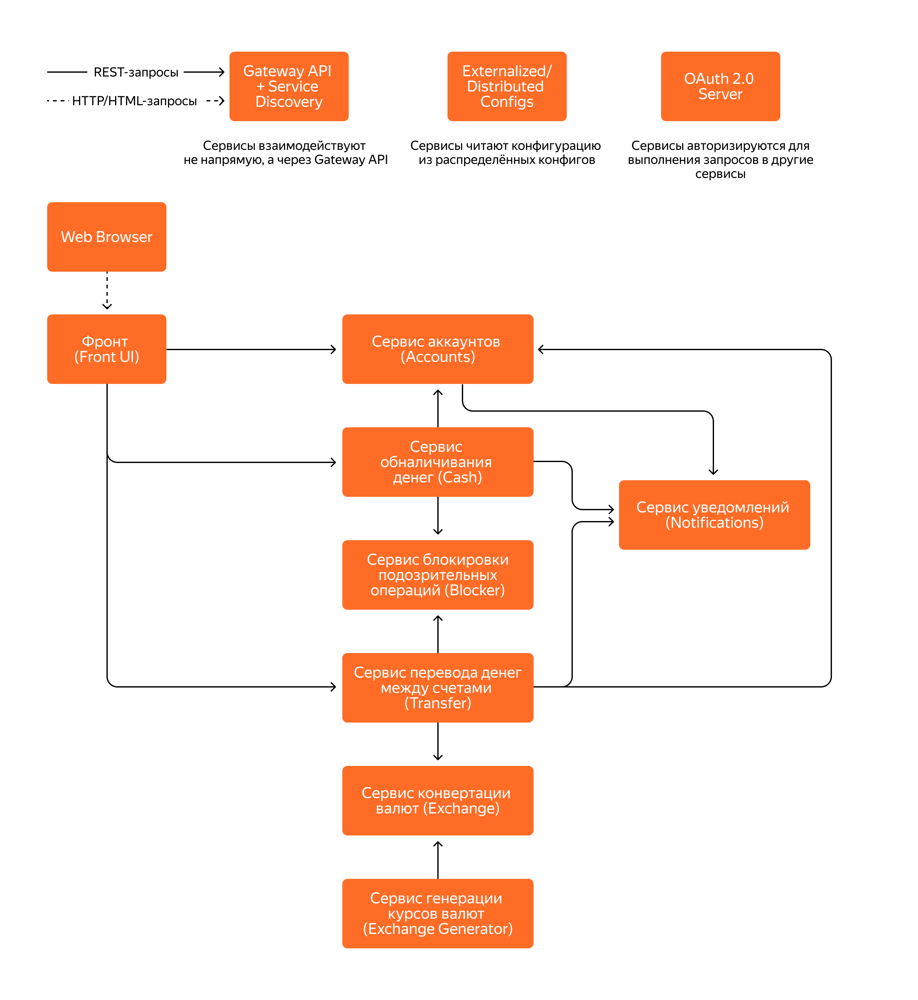
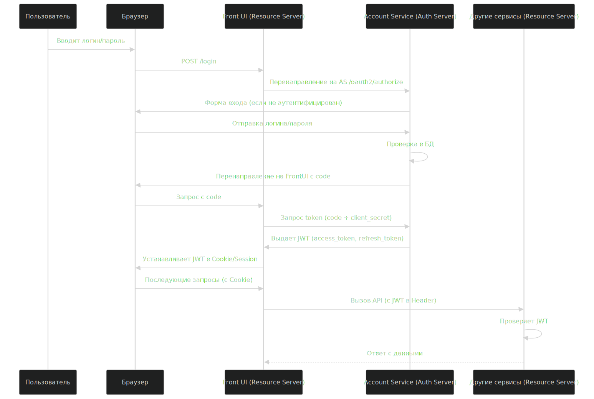
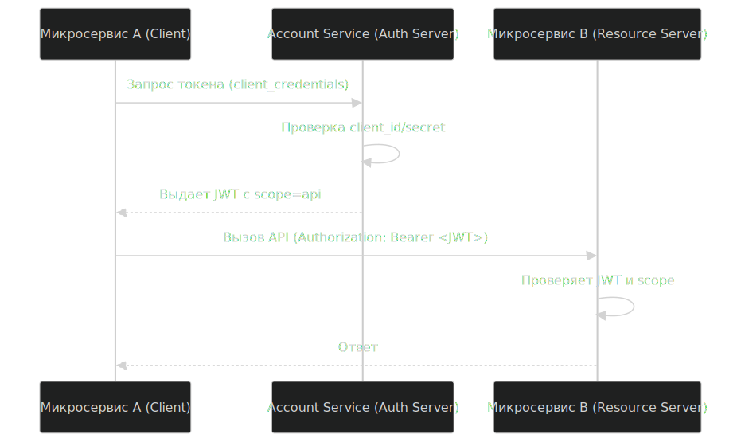

# microservice-banking

Микросервисное приложение «Банк» — это приложение с веб-интерфейсом, которое позволяет пользователю (клиенту банка):
- регистрироваться в системе по логину и паролю (заводить аккаунт);
- добавлять счета в различных валютах;
- класть виртуальные деньги на счёт и снимать их;
- переводить деньги между своими счетами с учётом конвертации в различные валюты;
- переводить деньги на другой счёт с учётом конвертации в различные валюты.

Приложение состоит из следующих микросервисов:
- фронта (Front UI);
- сервиса аккаунтов (Accounts);
- сервиса обналичивания денег (Cash);
- сервиса перевода денег между счетами одного или двух аккаунтов (Transfer);
- сервиса конвертации валют (Exchange);
- сервиса генерации курсов валют (Exchange Generator);
- сервиса блокировки подозрительных операций (Blocker);
- сервиса уведомлений (Notifications)

## Flow Diagram

## Описание

Ключевые решения и объяснения:
Service Discovery (Eureka): Все микросервисы регистрируются в Eureka. API Gateway и другие сервисы находят друг друга не по фиксированным URL, а по имени сервиса (bank-accounts-service). Это критически важно для динамичности среды.

API Gateway (Spring Cloud Gateway):

Единая точка входа: Весь внешний трафик идет через шлюз.

Маршрутизация: Перенаправляет запросы типа /api/accounts/** на bank-accounts-service.

Аутентификация: Проверяет JWT-токен в заголовке запроса перед тем, как пропустить его во внутреннюю сеть. Для этого шлюз интегрируется с Auth Server.

Кросc-доменные запросы (CORS): Централизованная обработка CORS на шлюзе избавляет от необходимости настраивать это в каждом микросервисе.

Config Server (Spring Cloud Config): Конфигурации всех сервисов (URL БД, учетные данные, настройки resilience) хранятся в Git-репозитории. Сервисы при старте обращаются к Config Server за своими настройками. Это позволяет менять конфигурацию для всех инстансов одновременно без пересборки.

Auth Server (Spring Authorization Server):

Поток OAuth 2.0:

Front UI (клиентское приложение) отправляет логин/пароль пользователя напрямую в Auth Server.

Auth Server возвращает JWT Access Token.

Front UI прикладывает этот токен к каждому запросу в API Gateway.

Роли и доступ: В токене будут содержаться роли (USER, ADMIN) и идентификатор пользователя (user_id). Это позволит сервисам (например, Accounts) проверять, что пользователь запрашивает данные только своего аккаунта.

Service-to-Service Auth: Микросервисы для общения между собой также будут использовать OAuth 2.0 Client Credentials Flow, получая свой технический токен.

Database per Service: Используем одну PostgreSQL, но с разными схемами (accounts_schema, exchange_schema). Это изолирует данные. Сервис Accounts не имеет прямого доступа к таблицам сервиса Exchange, и наоборот. Для связи между данными используется только API.

Resilience (Resilience4j):

Circuit Breaker: В сервисах Cash и Transfer при вызове Blocker Service нужно использовать Circuit Breaker. Если Blocker "лежит" или отвечает ошибками, цепь размыкается, и запросы временно идут в обход проверки (или используют fallback), чтобы не блокировать всю финансовую операцию.

Retry: В сервисе Exchange Generator при вызове Exchange Service можно добавить retry на случай временной недоступности.

Fallback: Для операций, где это критично (например, получение курса валют для конвертации в Transfer), нужно предусмотреть fallback — например, использовать кешированное значение или значение по умолчанию.

Взаимодействие между сервисами: Все взаимодействие должно быть асинхронным и неблокирующим. Я рекомендую использовать WebClient (из Spring WebFlux) вместо устаревшего RestTemplate. Он идеально подходит для реактивных цепочек вызовов.

Цепочка перевода денег (важный кейс):

Front UI -> API Gateway -> Transfer Service: "Перевести 100 USD со счета X на счет Y".

Transfer Service -> Accounts Service: Запрос для проверки, что счет X принадлежит пользователю и на нем достаточно средств. (Внутри Accounts Service проверяет user_id из JWT).

Transfer Service -> Exchange Service: Запрос на конвертацию 100 USD в валюту счета Y (например, CNY), если это необходимо.

Transfer Service -> Blocker Service: "Проверь операцию перевода от X к Y на сумму 100 USD". (Blocker может вернуть ALLOW или DENY).

Если все проверки пройдены, Transfer Service -> Accounts Service: Команда на списание средств со счета X.

Transfer Service -> Accounts Service: Команда на зачисление средств на счет Y.

Transfer Service -> Notifications Service: Отправка уведомлений обоим пользователям.

## Схема аутентификации пользователя

## Схема межсервисного взаимодействиятификации пользователя

# Как запускать 

## Consul для локального запуска сервисов

`
docker run -d --name consul -p 8500:8500 -p 8600:8600/udp consul:1.15 agent -server -ui -node=server-1 -bootstrap-expect=1 -client=0.0.0.0
`
